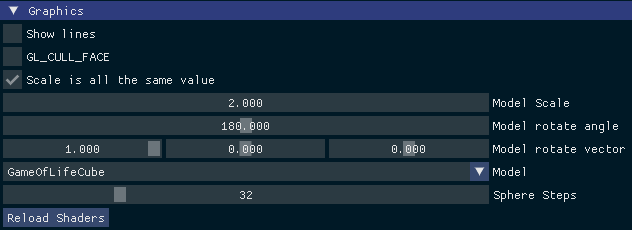

# EWU CSCD445 Project

Conway games of life on a cubes surface

## Table of Content

-   [EWU CSCD445 Project](#ewu-cscd445-project)
    -   [Table of Content](#table-of-content)
    -   [Team:](#team)
    -   [Conway games of life on a cubes surface](#conway-games-of-life-on-a-cubes-surface)
    -   [Functions](#functions)
    -   [Min Goal](#min-goal)
    -   [Report](#report)
        -   [How to run/use](#how-to-runuse)
        -   [Sample run](#sample-run)
        -   [SpeedUp](#speedup)
        -   [Video](#video)
    -   [Making the program](#making-the-program)
        -   [For the program](#for-the-program)
        -   [For Makefile](#for-makefile)
    -   [Notes](#notes)

## Team:

-   `Timbre Freeman` : Email <tfreeman3@ewu.edu>
-   `Nicholas Gainer`: Email <ngainer@ewu.edu>
-   `Jeremy Munson`: Email <jmunson3@ewu.edu>
-   `Johnathan Smith` : Email <jsmith245@ewu.edu>

## Conway games of life on a cubes surface

Each face of a cube will have a 2d grid of Conway games of life and their edges will interact with the connected face’s

## Functions

1.  OpenGL Cube
2.  CPU Conway games of life but for cube surface
3.  CUDA Conway, games of life but for cube surface

## Min Goal

At min, a cube with each face running Conway games of life on CUDA that has the edges interact with some start state to see it run (Ex have some Glider’s)

## World Start (Test data)

In `void GameOfLifeCube::cpuCreate(int size)` (file [GameOfLifeCube.cpp](src/GameOfLifeCube.cpp)) for the CPU Code and in `__host__ void cudaMainInitialize(int size_set)` (file [cudaMain.cu](src/cudaMain.cu)) for the GPU Code

``` cpp
for (int i = 0; i < column; ++i) {
    board[(3 * column) + i] = 1;
}
```

Making a Line 3 from the top of all faces of the cube

### Example

> World size of 12

Cube


Data of all faces (front, right, back, left, top, bottom)


## Report

### How to run/use

#### Start

Need the [project](project) executable (TODO: is dll’s needed?) and [res](res) folder to run

> Take no arguments

The program will log to console and log files in [logs](logs) folder using spdlog

A [imgui state](imgui.ini) file will also be made to remember somethings about GUI last state (Ex where within the window GUI is at)

Recommend using a game pad (Microsoft Xbox Series S\|X Controller) to look that the game of life cube


#### Using GUI

Using ImGUI give you menus to control the program from.

##### Camera


Gives control over the camera.

-   Check box `Stop Rotate Camera` Auto rotate the camera (`camera rotate angle value`)
-   Check box `Top view camera` when in default values move the camera to look from the top
-   Slider `camera rotate angle value` rotate the camera around the `Eye Center` + `Eye Hight` at the `Eye Radias`
-   Slider `Field of view` the “extent of the observable world seen at any given moment”
-   Slider `Eye Hight` the hight of the eye above the `Eye Center`
-   Slider `Eye Radias` the diastase the camera is from `Eye Center`
-   Drag `Eye Center` where the camera looking at

##### Light Settings


No need to use from the project (Leave at defaults)

##### Window Settings


Gives control and info over the window

-   Show info about the window and displays
-   Check box `vsync (frame limit)` let you trune on and off the frame limit to the frame rate of your display.
-   Check box `Full Screen` set the screen full screen
-   Color Edit `clear color` set the background color

##### ImGui Settings


No need to use from the project (Leave at defaults)

##### Graphics



Gives control over the graphics settings

-   Check box `Show lines` No need to use from the project (Leave at defaults)

-   Check box `CL_CULL_FACE` No need to use from the project (Leave at defaults)

    -   Check box `CL_CULL_FACE back` No need to use from the project (Leave at defaults)

-   Check box `Scale is all the same value` Has the `Model Scale` be the same value for all axis

-   Drag `Model Scale` scale of the model

    -   Drag 3 `Model Scale` scale of the model x, y, z 

        > Note: when change the scale using game pad will have all (x, y, z) be the same value

-   Slider `Model rotate angle` the angle the model is rotated about (`Model rotate vector`)

-   Slider 3 `Model rotate vector` the vector used when rotating the model

-   Combo `Model` No need to use from the project (Leave at defaults of `GameOfLifeCube`)

-   Slider `Sphere Steps` No need to use from the project (Leave at defaults) (used for the sphere model)

-   Button `Reload Shaders` No need to use from the project (Leave at defaults)

##### Game Pad


Give info about use the game pad and how to use it

> Note: only test with Xbox Series Controller over usb c cable on Linux

##### Game Of Life

> TODO: replace with update GUI screen shot


Gives control and info over the Game Of Life

-   TODO: add about reset
-   Slider `Speed of Game of Life (sec)` how much time need to pass before next state of current game of life (run update)
-   Check box `Run game of life` if the game of life is ruining or not (Use to stop the game of life and look at it without changing)
-   Check box `Use help image (f, l, r, b, t, b)` to use the help image to know what face we are looking at
-   Check box `Use CUDA instead of CPU` to use CUDA or CPU code
    -   Text `Warring, Using Help Image` when using the help image
    -   Text `Cuda not available` when no Nvidia CUDA device found
-   Button `Console Print CPU State` to print all 6 sides of Game Of Life from CPU to console and log files
-   TODO: world info
-   Time info
    -   Time need to run last update
    -   The speed up of the last update in cpu and gpu
    -   Continuous average of time need to run update
    -   The speed up of the Continuous average time in cpu and gpu
    -   What state each are at (number of time update is called)

### Sample run

BLANK

| Cuda/GPU                                                  | CPU                                                       |
| --------------------------------------------------------- | --------------------------------------------------------- |
| Cube                                                      | Cube                                                      |
|                                                           |                                                           |
| Data of all faces (front, right, back, left, top, bottom) | Data of all faces (front, right, back, left, top, bottom) |
|                                                           |                                                           |


### SpeedUp

BLANK

### Video

TODO Video Link

## Making the program

We only test on linux

### For the program

Need OpenGL lib and dev

Need GLEW lib and dev

Need GLU lib and dev

Need GLM dev

Need `git` clone [sub modules](.gitmodules)

### For Makefile

Need `CMake`

Need `pandoc` and `wkhtmltopdf`

Need `nvcc`

Wants `clang`

May Need `gcc`

#### Fedora install commands

``` sh
sudo dnf group install "C Development Tools and Libraries" "Development Tools"
sudo dnf install cmake
sudo dnf install libXi libXi-devel
sudo dnf install glew glew-devel libGLEW
sudo dnf install clang clang-devel clang-libs clang-tools-extra
sudo dnf install glew glew-devel glfw glfw-devel glm-devel
sudo dnf install pandoc wkhtmltopdf
```

## Notes

-   [OpenGL Code base off](https://github.com/tztz8/OpenGL-All)
